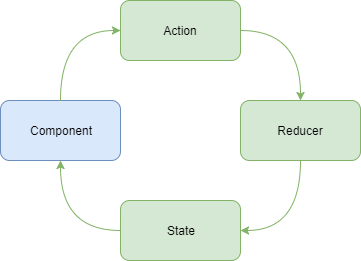

<!-- START doctoc generated TOC please keep comment here to allow auto update -->
<!-- DON'T EDIT THIS SECTION, INSTEAD RE-RUN doctoc TO UPDATE -->
**Table of Contents**

- [@ngrx/store](#ngrxstore)
  - [Introduction](#introduction)
    - [Behind the scenes](#behind-the-scenes)
    - [Core concepts](#core-concepts)
      - [Three main pieces](#three-main-pieces)
      - [Immutability](#immutability)
      - [One-way dataflow](#one-way-dataflow)
    - [Advantages](#advantages)
  - [Action](#action)
    - [Interface](#interface)
    - [Example](#example)
      - [Simple](#simple)
      - [Complex](#complex)
  - [Reducer](#reducer)
    - [Pure function](#pure-function)
    - [Interface](#interface-1)
    - [Rules to follow](#rules-to-follow)
    - [Example](#example-1)
      - [Simple](#simple-1)
      - [Complex](#complex-1)
  - [Selectors](#selectors)
    - [Interface](#interface-2)
    - [Advantages](#advantages-1)
    - [Example](#example-2)
    - [Functions](#functions)
      - [createSelector](#createselector)
      - [createFeatureSelector](#createfeatureselector)
  - [Examples](#examples)
    - [Reducers index](#reducers-index)
    - [Inside the app.module](#inside-the-appmodule)
    - [Inside the component](#inside-the-component)
  - [Components categories](#components-categories)
    - [Smart (Container components)](#smart-container-components)
    - [Dumb (Presentational/Child components)](#dumb-presentationalchild-components)
      - [Performance](#performance)
  - [AsyncPipe](#asyncpipe)
  - [Meta Reducers](#meta-reducers)

<!-- END doctoc generated TOC please keep comment here to allow auto update -->

# @ngrx/store

## Introduction

Managing state is hard.

`@ngrx/store` provides predictable state management using actions and reducers.

Store can be thought of as a `client-side ‘single source of truth’`, or a `client-side database`.

A snapshot of store at any point supply a complete representation of the relevant application state.

### Behind the scenes

**Just to give an idea, it's not a real implementation!**

*Credits to [btroncone](https://gist.github.com/btroncone/a6e4347326749f938510).*

```TypeScript
class Dispatcher extends Rx.Subject {
  dispatch(value: any): void {
    this.next(value);
  }
}

class Store<State> extends Rx.BehaviorSubject<State> {
    constructor(
        private dispatcher: Dispatcher,
        private reducer,
        initialState = {}
    ){
        super(initialState);
        this.dispatcher
            .scan((state, action) => this.reducer(state, action), initialState)
            .subscribe(state => super.next(state));
    }

    dispatch<V extends Action = Action>(action: V) {
        this.dispatcher.dispatch(action);
    }

    select<T>(key : string | (v: State) => T): Observable<T> {
        return this
            .map(state => state[key])
            .distinctUntilChanged();
    }
}
```

### Core concepts

#### Three main pieces

Each application built around store contain three main pieces:

* Actions.
* Reducers.
* Single application store.

#### Immutability

Store is **immutable (all changes produce new objects)**.

#### One-way dataflow



### Advantages

* Centralized state (**single source of truth**).
* Predictable state management (all mutations are explicit).
* Performant.
* Testable.
* Root and feature module support.

## Action

**Any time you want to change the state - you have to dispatch an action.**

**Action** describes something that has/should happen, but doesn't specify how.

### Interface

```TypeScript
interface Action {
    type: string;
    payload?: any;
}
```

*Note: `payload?: any;` allowed to be named differently.*

### Example

#### Simple

```TypeScript
// example.action.ts
import { Action } from '@ngrx/store';

// --- 1. Create string const for action. ---

// Actions values has to be unique and easily readable.
// So using namespace, e.g. `[Movie] Add`, might be a good idea.
// Tip: you can use current module name for namsespace.
export const UPDATE = '[Person] Update';

// --- 2. Create class for action. ---

// Usage of classes is determined by unlocking TypeScript's compile-time checking
// and triggering IDE autocompletion.
export class Update implements Action {
  readonly type = UPDATE;

  constructor(public payload: string) {}
}

// --- 3. Export all actions. ---

export type ExampleAction
  = Update;
  // | AnotherAction
  // | AnotherAction...
```

#### Complex

```TypeScript
// customers.action.ts
import { Action } from '@ngrx/store';

// Loading customers.
export const LOAD_CUSTOMERS = '[Users] Load Customers';
export const LOAD_CUSTOMERS_FAIL = '[Users] Load Customers Fail';
export const LOAD_CUSTOMERS_SUCCESS = '[Users] Load Customers Success';

export class LoadCustomers implements Action {
  readonly type = LOAD_CUSTOMERS;
}

export class LoadCustomersFail implements Action {
  readonly type = LOAD_CUSTOMERS_FAIL;

  constructor(public payload: any) {}
}

export class LoadCustomersSuccess implements Action {
  readonly type = LOAD_CUSTOMERS_SUCCESS;

  constructor(public payload: Customer[]) {}
}

// Creating customers.
export const CREATE_CUSTOMER = '[Users] Create Customer';
export const CREATE_CUSTOMER_FAIL = '[Users] Create Customer Fail';
export const CREATE_CUSTOMER_SUCCESS = '[Users] Create Customer Success';

export class CreateCustomer implements Action {
  readonly type = CREATE_CUSTOMER;

  constructor(public payload: Customer) {}
}

export class CreateCustomerFail implements Action {
  readonly type = CREATE_CUSTOMER_FAIL;

  constructor(public payload: any) {}
}

export class CreateCustomerSuccess implements Action {
  readonly type = CREATE_CUSTOMER_SUCCESS;

  constructor(public payload: Customer) {}
}

// ...Other CRUD actions.

// Exporting all actions.
export type CustomersAction
  = LoadCustomers | LoadCustomersFail | LoadCustomersSuccess
  | CreateCustomer | CreateCustomerFail | CreateCustomerSuccess
  ;
```

## Reducer

**Reducer** is a pure function that takes the previous state and an action and synchronously returns the new state.

Combination of reducers makes up a representation of application state at any given time.

### Pure function

* rely only on it's arguments;
* doesn't produce observable side-effects;
* doesn't modify input values (creates new ones when required).

### Interface

```TypeScript
interface Reducer<State> {
    (state: State, action: Action): State;
}
```

### Rules to follow

* Is a **pure function**.
* Focused on a specific section, or slice of state *(similar to a table in a database)*.
* Always returns a representation of state.

### Example

#### Simple

```TypeScript
// example.reducer.ts

// --- 1. Import corresponding actions. ---
import * as fromExample from './example.actions';

// --- 2. Create interface of current part of state. ---
export interface ExampleState {
  name: string;
}

// --- 3. Create initial state. ---
const initialState: ExampleState = {
  name: ''
};

// --- 4. Create reducer. ---
export function reducer(state: ExampleState = initialState, action: fromExample.ExampleAction): ExampleState {
  switch (action.type) {
    case fromExample.UPDATE: {
      return {name: action.payload};
    }

    default: {
      return state;
    }
  }
}

// --- 5. Create selectors for each property in interface. ---
export const getUserName = (state: ExampleState) => state.name;
```

#### Complex

```TypeScript
// customers.reducer.ts
import * as fromCustomers from '../actions/customers.actions';
import { Customer } from '../../models/customer.model';

export interface CustomerState {
  entities: { [id: number]: Customer };
  loaded: boolean;
  loading: boolean;
}

export const initialState: CustomerState = {
  entities: {},
  loaded: false,
  loading: false,
};

export function reducer(state: CustomerState = initialState, action: fromCustomers.CustomersAction): CustomerState {
  switch (action.type) {
    case fromCustomers.LOAD_CUSTOMERS: {
      return {
        ...state,
        loading: true,
      };
    }

    case fromCustomers.LOAD_CUSTOMERS_SUCCESS: {
      const customers = action.payload;

      const entities = customers.reduce((allEntities: { [id: number]: Customer }, customer: Customer) => {
        return {
          ...allEntities,
          [customer.id]: customer,
        };
      }, {...state.entities});

      return {
        ...state,
        loaded: true,
        loading: false,
        entities,
      };
    }

    case fromCustomers.LOAD_CUSTOMERS_FAIL: {
      return {
        ...state,
        loaded: false,
        loading: false,
      };
    }

    case fromCustomers.CREATE_CUSTOMER_SUCCESS:
    case fromCustomers.UPDATE_CUSTOMER_SUCCESS: {
      const customer = action.payload;
      const entities = {
        ...state.entities,
        [customer.id]: customer,
      };

      return {
        ...state,
        entities,
      };
    }

    case fromCustomers.REMOVE_CUSTOMER_SUCCESS: {
      const customer = action.payload;

      // Desctucturing to remove customer.
      const {[customer.id]: removed, ...entities} = state.entities;

      return {
        ...state,
        entities,
      };
    }

    default: {
        return state;
    }
  }
}

export const getCustomersEntities = (state: CustomerState) => state.entities;
export const getCustomersLoaded = (state: CustomerState) => state.loaded;
export const getCustomersLoading = (state: CustomerState) => state.loading;
```

## Selectors

**Selectors** - methods used for obtaining slices of store state.

### Interface

```TypeScript
interface Selector<AppState, SelectedState> {
    (state: AppState): SelectedState;
}
```

### Advantages

* reducing responsibility of components;
* can be shared across the entire app.

### Example

```TypeScript
// reducers.ts
export function selectResults(state: State) {
    return state.namespace.resultsKey;
}
```

Inside component:

```TypeScript
import * as fromRoot from './reducers';

this.store.select(fromRoot.selectResults)
```

### Functions

When using the `createSelector` and `createFeatureSelector` functions @ngrx/store keeps track of the latest arguments in which your selector function was invoked.

Because selectors are pure functions, the last result can be returned when the arguments match without reinvoking selector function.
This can provide performance benefits (memoization).

#### createSelector
Returns a callback function for selecting a slice of state.

```TypeScript
// reducers.ts
import { createSelector } from '@ngrx/store';

export interface FeatureState {
  counter: number;
}

export interface AppState {
  feature: FeatureState
}

export const selectFeature = (state: AppState) => state.feature;
export const selectFeatureCount = createSelector(selectFeature, (state: FeatureState) => state.counter);
```

#### createFeatureSelector
Is a convenience method for returning a top level feature state.
Returns a typed selector function for a feature slice of state.

```TypeScript
// reducers.ts

// export const selectFeature = (state: AppState) => state.feature;
// becomes
export const selectFeature = createFeatureSelector<FeatureState>('feature');
```

## Examples

### Reducers index

```TypeScript
// reducers/index.ts
import { ActionReducerMap } from '@ngrx/store';

import * as fromExample1 from './example1.reducer';
import * as fromExample2 from './example2.reducer';

export interface State {
  example1: fromExample1.State;
  example2: fromExample2.State;
}

export const reducers: ActionReducerMap<State> = {
  example1: fromExample1.reducer,
  example2: fromExample2.reducer,
}
```

### Inside the app.module

```TypeScript
import { StoreModule } from '@ngrx/store';
import { reducers } from './reducers';

@NgModule({
  imports: [
    StoreModule.forRoot(
      reducers,
      // { initialState: {} }
      ),
  ],
})
export class AppModule {}
```

### Inside the component

```TypeScript
import { Store } from '@ngrx/store';

import * as fromRoot from './reducers';
import * as ExampleActions from './example-actions';

@Component({})
export class ExampleComponent {
    constructor(private store: Store<fromRoot.State>) {}

    setExample(input): void {
        this.store.dispatch(new ExampleActions.ActionName(input));
    }

    getExample(): Observable<any> {
        return this.store.select(fromRoot.selectResults);
    }
}
```

## Components categories

*Credits to [btroncone](https://gist.github.com/btroncone/a6e4347326749f938510).*

Components in Store application falls into one of two categories: **smart** or **dumb**.

### Smart (Container components)

* routable components at root level;
* have direct access to the store (or to a derivative);
* handle view events and the dispatching of actions (through a service or directly);
* handle the logic behind events emitted up from child components within the same view.

### Dumb (Presentational/Child components)

* generally for presentation only;
* rely exclusively on `@Input` parameters;
* invokes callbacks via `@Output`;
* when relevant events occur in dumb components, they are emitted up to be handled by a parent smart component;
* make up the majority of your application;
* should be small, focused, and reusable.

#### Performance

When components rely only on `@Input` parameters, and those input references do not change,
it is possible to tell Angular to skip running change detection
(until there is a change in input references) to provide performance benefit.

To enable this utilize the `changeDetectionStrategy` of `OnPush`.

*Note: It can be used on container components too (if component relies only on observables).*

## AsyncPipe

The **AsyncPipe** can handle `Observables` and `Promises` in template.

```HTML
{{ stream$ | async }}
```

This pipe also handles unsubscribing (no need to manually cleaning up subscriptions on destroy).


## Meta Reducers

@ngrx/store composes map of reducers into a single reducer.

`metaReducers` configuration option allows to provide an array of meta-reducers that are **composed from right to left**.

```TypeScript
// meta-reducers.ts
import { ActionReducer, MetaReducer } from '@ngrx/store';
import { reducers } from './reducers';

// console.log all actions
export function debug(reducer: ActionReducer<any>): ActionReducer<any> {
  return function(state, action) {
    console.log('state', state);
    console.log('action', action);

    return reducer(state, action);
  }
}

export const metaReducers: MetaReducer<any>[] = [debug];
```

```TypeScript
// app.module.ts
import { StoreModule } from '@ngrx/store';

import { metaReducers } from './meta-reducers';
import { reducers } from './reducers';

@NgModule({
  imports: [
    StoreModule.forRoot(reducers, { metaReducers })
  ]
})
export class AppModule {}
```
