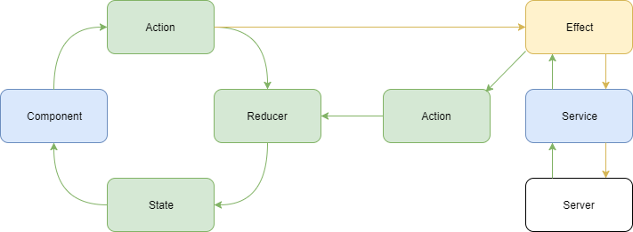

<!-- START doctoc generated TOC please keep comment here to allow auto update -->
<!-- DON'T EDIT THIS SECTION, INSTEAD RE-RUN doctoc TO UPDATE -->
**Table of Contents**

- [@ngrx/store](#ngrxstore)
  - [Introduction](#introduction)
    - [Behind the scenes](#behind-the-scenes)
    - [Core concepts](#core-concepts)
      - [Three main pieces](#three-main-pieces)
      - [Immutability](#immutability)
      - [One-way dataflow](#one-way-dataflow)
    - [Advantages](#advantages)
    - [Drawbacks](#drawbacks)
    - [What to store?](#what-to-store)
  - [Action](#action)
    - [Interface](#interface)
    - [Example](#example)
      - [Simple](#simple)
      - [Complex](#complex)
  - [Reducer](#reducer)
    - [Pure function](#pure-function)
    - [Interface](#interface-1)
    - [Rules to follow](#rules-to-follow)
    - [Example](#example-1)
      - [Simple](#simple-1)
      - [Complex](#complex-1)
  - [Selectors](#selectors)
    - [Interface](#interface-2)
    - [Advantages](#advantages-1)
    - [Functions](#functions)
      - [createFeatureSelector](#createfeatureselector)
      - [createSelector](#createselector)
    - [Examples](#examples)
      - [Selector file](#selector-file)
      - [Inside component](#inside-component)
  - [Structuring & Setting up](#structuring--setting-up)
    - [Root index.ts](#root-indexts)
    - [Actions and Selectors index.ts](#actions-and-selectors-indexts)
    - [Effects](#effects)
      - [index.ts](#indexts)
      - [Inside module](#inside-module)
    - [Reducers](#reducers)
      - [index.ts](#indexts-1)
      - [Inside module](#inside-module-1)
  - [Examples](#examples-1)
    - [Inside the component](#inside-the-component)
  - [Components categories](#components-categories)
    - [Smart (Container components)](#smart-container-components)
    - [Dumb (Presentational/Child components)](#dumb-presentationalchild-components)
      - [Performance](#performance)
  - [AsyncPipe](#asyncpipe)
  - [Meta Reducers](#meta-reducers)
- [@ngrx/effects](#ngrxeffects)
  - [API](#api)
    - [Actions](#actions)
    - [ofType](#oftype)
    - [@Effect](#effect)
      - [Non-dispatching effect](#non-dispatching-effect)
      - [Example](#example-2)
  - [Inside module](#inside-module-2)
- [@ngrx/router-store](#ngrxrouter-store)
  - [Custom serializer](#custom-serializer)
  - [Boilerplate](#boilerplate)
    - [actions/router.actions.ts](#actionsrouteractionsts)
    - [reducers/index.ts](#reducersindexts)
    - [effects/router.effects.ts](#effectsroutereffectsts)
    - [app.module.ts](#appmodulets)
  - [Examples](#examples-2)
    - [Dispatching an action](#dispatching-an-action)
- [Check Store](#check-store)
  - [Example](#example-3)
    - [guard file](#guard-file)
    - [guards/index.ts](#guardsindexts)
    - [some.module.ts](#somemodulets)
    - [some-routing.module.ts](#some-routingmodulets)
- [@ngrx/store-devtools](#ngrxstore-devtools)
- [Resources](#resources)
- [Look for more](#look-for-more)

<!-- END doctoc generated TOC please keep comment here to allow auto update -->

# @ngrx/store

## Introduction

Managing state is hard.

`@ngrx/store` provides predictable state management using actions and reducers.

Store can be thought of as a `client-side ‘single source of truth’`, or a `client-side database`.

A snapshot of store at any point supply a complete representation of the relevant application state.

### Behind the scenes

**Just to give an idea, it's not a real implementation!**

```TypeScript
class Dispatcher extends Rx.Subject {
  dispatch(value: any): void {
    this.next(value);
  }
}

class Store<State> extends Rx.BehaviorSubject<State> {
    constructor(
        private dispatcher: Dispatcher,
        private reducer,
        initialState = {}
    ){
        super(initialState);
        this.dispatcher
            .scan((state, action) => this.reducer(state, action), initialState)
            .subscribe(state => super.next(state));
    }

    dispatch<V extends Action = Action>(action: V) {
        this.dispatcher.dispatch(action);
    }

    select<T>(key : string | (v: State) => T): Observable<T> {
        return this
            .map(state => state[key])
            .distinctUntilChanged();
    }
}
```

### Core concepts

#### Three main pieces

Each application built around store contain three main pieces:

* Actions.
* Reducers.
* Single application store.

#### Immutability

Store is **immutable (all changes produce new objects (shallow copies, not deep copies))**.

#### One-way dataflow


### Advantages

* Centralized state (**single source of truth**) allows to observe the current data state from anywhere in the app.
* Isolation of data (data flows one-way).
* Predictable state management (all mutations are explicit).
* Performant (allows to disable Angular's change detection).
* Debuggable (time lapse sequence of state changes can be compared one to another).
* Testable (reducers are pure functions).
* Root and feature module support.

### Drawbacks

* Learning Curve.
* Integrating pattern with 3rd party packages can be difficult.

### What to store?

>"we don’t intend Redux to be used for all state. Just whatever seems significant to the app. I would argue inputs and animation state should be handled by *(state abstraction)*. Redux works better for things like fetched data and locally modified models."
*by [@gaearon](https://github.com/gaearon)*

## Action

**Any time you want to change the state - you have to dispatch an action.**

**Action** describes something that has/should happen, but doesn't specify how.

### Interface

```TypeScript
interface Action {
    type: string;
    payload?: any;
}
```

*Note: `payload?: any;` allowed to be named differently and you can supply additional properties.*

### Example

#### Simple

```TypeScript
// example.action.ts
import { Action } from '@ngrx/store';

// --- 1. Create string const for action. ---

// Actions values has to be unique and easily readable.
// So using namespace, e.g. `[Movie] Add`, might be a good idea.
// Tip: you can use current module name for namsespace.
// Tip#2: you can use enum instead of constants (see complex example).
export const UPDATE = '[Person] Update';

// --- 2. Create class for action. ---

// Usage of classes is determined by unlocking TypeScript's compile-time checking
// and triggering IDE autocompletion.
export class Update implements Action {
  readonly type = UPDATE;

  constructor(public payload: string) {}
}

// --- 3. Export all actions. ---

export type ExampleAction
  = Update;
  // | AnotherAction
  // | AnotherAction...
```

#### Complex

```TypeScript
// customers.action.ts
import { Action } from '@ngrx/store';

export enum CustomersActionTypes {
  LOAD_CUSTOMERS = '[Users] Load Customers',
  LOAD_CUSTOMERS_FAIL = '[Users] Load Customers Fail',
  LOAD_CUSTOMERS_SUCCESS = '[Users] Load Customers Success',
  CREATE_CUSTOMER = '[Users] Create Customer',
  CREATE_CUSTOMER_FAIL = '[Users] Create Customer Fail',
  CREATE_CUSTOMER_SUCCESS = '[Users] Create Customer Success',
  // ...Other CRUD actions.
}

// Loading customers.
export class LoadCustomers implements Action {
  readonly type = CustomersActionTypes.LOAD_CUSTOMERS;
}

export class LoadCustomersFail implements Action {
  readonly type = CustomersActionTypes.LOAD_CUSTOMERS_FAIL;

  constructor(public payload: any) {}
}

export class LoadCustomersSuccess implements Action {
  readonly type = CustomersActionTypes.LOAD_CUSTOMERS_SUCCESS;

  constructor(public payload: Customer[]) {}
}

// Creating customers.
export class CreateCustomer implements Action {
  readonly type = CustomersActionTypes.CREATE_CUSTOMER;

  constructor(public payload: Customer) {}
}

export class CreateCustomerFail implements Action {
  readonly type = CustomersActionTypes.CREATE_CUSTOMER_FAIL;

  constructor(public payload: any) {}
}

export class CreateCustomerSuccess implements Action {
  readonly type = CustomersActionTypes.CREATE_CUSTOMER_SUCCESS;

  constructor(public payload: Customer) {}
}

// ...Other CRUD actions.

// Exporting all actions.
export type CustomersAction
  = LoadCustomers | LoadCustomersFail | LoadCustomersSuccess
  | CreateCustomer | CreateCustomerFail | CreateCustomerSuccess
  ;
```

## Reducer

**Reducer** is a pure function that takes the previous state and an action and synchronously returns the new state.

Combination of reducers makes up a representation of application state at any given time.

### Pure function

* rely only on it's arguments;
* doesn't produce observable side-effects;
* doesn't modify input values (creates new ones when required).

### Interface

```TypeScript
interface Reducer<State> {
    (state: State, action: Action): State;
}
```

### Rules to follow

* Is a **pure function**.
* Focused on a specific section, or slice of state *(similar to a table in a database)*.
* Always returns a representation of state.

### Example

#### Simple

```TypeScript
// example.reducer.ts

// --- 1. Import corresponding actions. ---
import * as fromExample from './example.actions';

// --- 2. Create interface of current part of state. ---
export interface ExampleState {
  name: string;
}

// --- 3. Create initial state. ---
const initialState: ExampleState = {
  name: ''
};

// --- 4. Create reducer. ---
export function reducer(state: ExampleState = initialState, action: fromExample.ExampleAction): ExampleState {
  switch (action.type) {
    case fromExample.UPDATE: {
      return {name: action.payload};
    }

    default: {
      return state;
    }
  }
}

// --- 5. Create selectors for each property in interface. ---
export const getUserName = (state: ExampleState) => state.name;
```

#### Complex

```TypeScript
// customers.reducer.ts
import { CustomersAction, CustomersActionTypes } from '../actions/customers.action';
import { Customer } from '../../models/customer.model';

export interface CustomerState {
  entities: { [id: number]: Customer };
  loaded: boolean;
  loading: boolean;
}

export const initialState: CustomerState = {
  entities: {},
  loaded: false,
  loading: false,
};

export function reducer(state = initialState, action: CustomersAction): CustomerState {
  switch (action.type) {
    case CustomersActionTypes.LOAD_CUSTOMERS: {
      return {
        ...state,
        loading: true
      };
    }

    case CustomersActionTypes.LOAD_CUSTOMERS_SUCCESS: {
      const customers = action.payload;

      const entities = customers.reduce((allEntities: { [id: number]: Customer }, customer: Customer) => {
        return {
          ...allEntities,
          [customer.id]: customer
        };
      }, {...state.entities});

      return {
        ...state,
        loading: false,
        loaded: true,
        entities,
      };
    }

    case CustomersActionTypes.LOAD_CUSTOMERS_FAIL: {
      return {
        ...state,
        loading: false,
        loaded: false
      };
    }

    // One of `switch`'s benefits is preventing duplication.
    case CustomersActionTypes.CREATE_CUSTOMER_SUCCESS:
    case CustomersActionTypes.UPDATE_CUSTOMER_SUCCESS: {
      const customer = action.payload;
      const entities = {
        ...state.entities,
        [customer.id]: customer,
      };

      return {
        ...state,
        entities,
      };
    }

    case CustomersActionTypes.REMOVE_CUSTOMER_SUCCESS: {
      const customer = action.payload;

      // Desctucturing to remove.
      const {[customer.id]: removed, ...entities} = state.entities;

      return {
        ...state,
        entities
      };
    }

    default: {
        return state;
    }
  }
}

export const getCustomersEntities = (state: CustomerState) => state.entities;
export const getCustomersLoaded = (state: CustomerState) => state.loaded;
export const getCustomersLoading = (state: CustomerState) => state.loading;
```

## Selectors

**Selectors** - methods used for obtaining slices of store state.

### Interface

```TypeScript
interface Selector<AppState, SelectedState> {
    (state: AppState): SelectedState;
}
```

### Advantages

* Reduce responsibility of components.
* Can be shared across the entire app.

### Functions

When using the `createSelector` and `createFeatureSelector` functions @ngrx/store keeps track of the latest arguments in which your selector function was invoked.

Because selectors are pure functions, the last result can be returned when the arguments match without reinvoking selector function.
This can provide performance benefits (memoization).

#### createFeatureSelector

Is a convenience method for returning a top level feature state.
Returns a typed selector function for a feature slice of state.

```TypeScript
// store/reducers/index.ts
import { createFeatureSelector } from '@ngrx/store';

export const getUsersState = createFeatureSelector<UsersState>('users');
```

```TypeScript
// users.module.ts
@NgModule({
  imports: [
    StoreModule.forFeature('users', reducers),
  ],
})
```

#### createSelector

Returns a callback function for selecting a slice of state.

```TypeScript
import { createSelector, createFeatureSelector } from '@ngrx/store';

export interface FeatureState {
  counter: number;
}

export const selectFeature = createFeatureSelector<FeatureState>('feature');
export const selectFeatureCount = createSelector(selectFeature, (state: FeatureState) => state.counter);
```

### Examples

#### Selector file

```TypeScript
// customers.selector.ts
import { createSelector } from '@ngrx/store';
import { Customer } from '../../models/customer.model';

import * as fromRoot from '../../../store';
import * as fromFeature from '../reducers';
import * as fromCustomers from '../reducers/customers.reducer';
import * as fromProducts from './products.selectors';

export const getCustomersState = createSelector(fromFeature.getUsersState, (state: fromFeature.UsersState) => state.customers);

export const getCustomersEntities = createSelector(getCustomersState, fromCustomers.getCustomersEntities);

export const getSelectedCustomer = createSelector(getCustomersEntities, fromRoot.getRouterState, (entities, router): Customer => {
  return router.state && entities[router.state.params.customerId];
});

export const getAllCustomers = createSelector(getCustomersEntities, (entities) => {
  return Object.keys(entities).map(id => entities[id]);
});

export const getCustomersLoaded = createSelector(getCustomersState, fromCustomers.getCustomersLoaded);

export const getCustomersLoading = createSelector(getCustomersState, fromCustomers.getCustomersLoading);

export const getCustomerVisualised = createSelector(
  getSelectedCustomer,
  fromProducts.getProductsEntities,
  fromProducts.getSelectedProducts,
  (customer, productsEntities, selectedProducts) => {
    const products = selectedProducts.map(id => productsEntities[id]);
    return {...customer, products};
  }
);
```

#### Inside component

```TypeScript
import * as fromStore from '../../store';

ngOnInit() {
  this.customers$ = this.store.select<Customer[]>(fromStore.getAllCustomers);
}
```

## Structuring & Setting up


### Root index.ts

```TypeScript
// root index.ts
export * from './actions';
export * from './effects';
export * from './reducers';
export * from './selectors';
```

### Actions and Selectors index.ts

```TypeScript
// actions/index.ts
// selectors/index.ts
export * from './each-file';
```

### Effects

#### index.ts

```TypeScript
// effects/index.ts
import { SomeEffects } from './each.effect';

export const effects: any[] = [
  SomeEffects,
  // ...
];

export * from './each.effect';
```

#### Inside module

```TypeScript
// some.module.ts
import { EffectsModule } from '@ngrx/effects';
import { effects } from './store';

@NgModule({
  imports: [
    EffectsModule.forFeature(effects),
  ],
})
export class SomeModule { }
```

### Reducers

#### index.ts

```TypeScript
// reducers/index.ts
import { ActionReducerMap, createFeatureSelector } from '@ngrx/store';

// Importing all reducers from current folder.
import * as fromCustomers from './customers.reducer';
import * as fromProoducts from './products.reducer';

// Creating interface for feature (current module).
export interface UsersState {
  customers: fromCustomers.CustomerState;
  products: fromProoducts.ProductsState;
}

// Creating object with imported reducers using feature interface and ActionReducerMap.
export const reducers: ActionReducerMap<UsersState> = {
  customers: fromCustomers.reducer,
  products: fromProoducts.reducer,
};

// Creating feature selector for current module to use in selectors.
export const getUsersState = createFeatureSelector<UsersState>('users');
```

#### Inside module

```TypeScript
// some.module.ts
import { StoreModule } from '@ngrx/store';
import { reducers } from './store';

@NgModule({
  imports: [
    StoreModule.forFeature('users', reducers),
  ],
})
export class SomeModule { }
```

## Examples

### Inside the component

```TypeScript
import { Store } from '@ngrx/store';

import * as fromRoot from './reducers';
import * as ExampleActions from './example-actions';

@Component({})
export class ExampleComponent {
    constructor(private store: Store<fromRoot.State>) {}

    setExample(input): void {
        this.store.dispatch(new ExampleActions.ActionName(input));
    }

    getExample(): Observable<any> {
        return this.store.select(fromRoot.selectResults);
    }
}
```

## Components categories

Components in Store application falls into one of two categories: **smart** or **dumb**.

### Smart (Container components)

* routable components at root level;
* have direct access to the store (or to a derivative);
* handle view events and the dispatching of actions (through a service or directly);
* handle the logic behind events emitted up from child components within the same view.

### Dumb (Presentational/Child components)

* generally for presentation only;
* rely exclusively on `@Input` parameters;
* invokes callbacks via `@Output`;
* when relevant events occur in dumb components, they are emitted up to be handled by a parent smart component;
* make up the majority of your application;
* should be small, focused, and reusable.

#### Performance

When components rely only on `@Input` parameters, and those input references do not change,
it is possible to tell Angular to skip running change detection
(until there is a change in input references) to provide performance benefit.

To enable this utilize the `changeDetectionStrategy` of `OnPush`.

*Note: It can be used on container components too (if component relies only on observables).*

## AsyncPipe

The **AsyncPipe** can handle `Observables` and `Promises` in template.

```HTML
{{ stream$ | async }}
```

This pipe also handles unsubscribing (no need to manually cleaning up subscriptions on destroy).


## Meta Reducers

@ngrx/store composes map of reducers into a single reducer.

`metaReducers` configuration option allows to provide an array of meta-reducers that are **composed from right to left**.

```TypeScript
// meta-reducers.ts
import { ActionReducer, MetaReducer } from '@ngrx/store';
import { reducers } from './reducers';

// console.log all actions
export function debug(reducer: ActionReducer<any>): ActionReducer<any> {
  return function(state, action) {
    console.log('state', state);
    console.log('action', action);

    return reducer(state, action);
  }
}

export const metaReducers: MetaReducer<any>[] = [debug];
```

```TypeScript
// app.module.ts
import { StoreModule } from '@ngrx/store';

import { metaReducers } from './meta-reducers';
import { reducers } from './reducers';

@NgModule({
  imports: [
    StoreModule.forRoot(reducers, { metaReducers })
  ]
})
export class AppModule {}
```

# @ngrx/effects

Manages **side effects** - code that interacts with the outside world (HTTP, web sockets, offline storage, etc.).

Main point is to **listen to @ngrx/store action and return a new action**.

Isolates side effect from components, so components becomes easier to test.



## API

### Actions

`Actions` is an Observable to inject in a constructor.

```TypeScript
import { Actions } from '@ngrx/effects';

constructor(private actions$: Actions) { }
```

### ofType

```TypeScript
export declare function ofType<T extends Action>(...allowedTypes: string[]): (source$: Actions<T>) => Actions<T>;
```

### @Effect

`@Effect` is a decorator to hint @ngrx/effects that we want to subscribe to some properties.

#### Non-dispatching effect

When there is no need to dispatch a new action from the effect:

```TypeScript
@Effect({dispatch: false})
```

#### Example

```TypeScript
// customers.effects.ts
import { Injectable } from '@angular/core';
import { Actions, Effect, ofType } from '@ngrx/effects';
import { map, switchMap, catchError } from 'rxjs/operators';
import { of } from 'rxjs/observable/of';

import * as fromRoot from '../../../store';
import * as fromServices from '../../services';
import * as customerActions from '../actions/customers.action';
import { CustomersActionTypes } from '../actions/customers.action';

@Injectable()
export class CustomersEffects {
  constructor(private actions$: Actions,
              private customersService: fromServices.CustomersService) {
  }

  @Effect()
  loadCustomers$ = this.actions$.pipe(
    ofType<customerActions.LoadCustomers>(CustomersActionTypes.LOAD_CUSTOMERS),
    switchMap(() => {
      return this.customersService.getCustomers().pipe(
        map(customers => new customerActions.LoadCustomersSuccess(customers)),
        catchError(error => of(new customerActions.LoadCustomersFail(error)))
      );
    })
  );

  @Effect()
  createCustomer$ = this.actions$.pipe(
    ofType<customerActions.CreateCustomer>(CustomersActionTypes.CREATE_CUSTOMER),
    map(action => action.payload),
    switchMap(customer => {
      return this.customersService.createCustomer(customer).pipe(
        map(createdCustomer => new customerActions.CreateCustomerSuccess(createdCustomer)),
        catchError(error => of(new customerActions.CreateCustomerFail(error)))
      );
    })
  );

  @Effect()
  createCustomerSuccess$ = this.actions$.pipe(
    ofType<customerActions.CreateCustomerSuccess>(CustomersActionTypes.CREATE_CUSTOMER_SUCCESS),
    map(action => action.payload),
    map(customer => new fromRoot.Go({
      path: ['/users', customer.id]
    })),
  );

  @Effect()
  updateCustomer$ = this.actions$.pipe(
    ofType<customerActions.UpdateCustomer>(CustomersActionTypes.UPDATE_CUSTOMER),
    map(action => action.payload),
    switchMap(customer => {
      return this.customersService.updateCustomer(customer).pipe(
        map(updatedCustomer => new customerActions.UpdateCustomerSuccess(updatedCustomer)),
        catchError(error => of(new customerActions.UpdateCustomerFail(error)))
      );
    })
  );

  @Effect()
  removeCustomer$ = this.actions$.pipe(
    ofType<customerActions.RemoveCustomer>(CustomersActionTypes.REMOVE_CUSTOMER),
    map(action => action.payload),
    switchMap(customer => {
      return this.customersService.removeCustomer(customer).pipe(
        map(() => new customerActions.RemoveCustomerSuccess(customer)),
        catchError(error => of(new customerActions.RemoveCustomerFail(error)))
      );
    })
  );

  @Effect()
  handleCustomerSuccess$ = this.actions$.pipe(
    ofType<customerActions.RemoveCustomerSuccess | customerActions.UpdateCustomerSuccess>
    (CustomersActionTypes.REMOVE_CUSTOMER_SUCCESS, CustomersActionTypes.UPDATE_CUSTOMER_SUCCESS),
    map(customer => new fromRoot.Go({
      path: ['/users'],
    }))
  );
}
```

## Inside module
[Inside module](#inside-module)

# @ngrx/router-store

Binds **Angular Router State** to **Application State (@ngrx/store)**
, which gives more power to compose the State as a single source of truth.

@ngrx/router-store is listening to Angular routing events and updating store with current route (using custom serializer).

As an additional benefit, we can obliterate Angular `Router` as a DI in the component constructor.

## Custom serializer

Class (usually in `reducers/index.ts`) with `serialize` method to transform Angular `RouterStateSnapshot`
into a `RouterStateUrl` to bind to the Store.

[Must be provided](#appmodulets).

## Boilerplate

@ngrx/router-store setup is done in root app module.

### actions/router.actions.ts

```TypeScript
import { Action } from '@ngrx/store';
import { NavigationExtras } from '@angular/router';

export enum RouterActionTypes {
  GO = '[Router] Go',
  BACK = '[Router] Back',
  FORWARD = '[Router] Forward',
}

export class Go implements Action {
  readonly type = RouterActionTypes.GO;
  constructor(public payload: {
    path: any[];
    query?: object,
    extras?: NavigationExtras
  }) {}
}

export class Back implements Action {
  readonly type = RouterActionTypes.BACK;
}

export class Forward implements Action {
  readonly type = RouterActionTypes.FORWARD;
}

export type RouterActions = Go | Back | Forward;
```

### reducers/index.ts

```TypeScript
import { ActivatedRouteSnapshot, Params, RouterStateSnapshot } from '@angular/router';
import { ActionReducerMap, createFeatureSelector } from '@ngrx/store';

import * as fromRouter from '@ngrx/router-store';

export interface RouterStateUrl {
  // Full url.
  url: string;
  // `?param=value`
  queryParams: Params;
  // `/:id`
  params: Params;
}

export interface State {
  routerReducer: fromRouter.RouterReducerState<RouterStateUrl>;
}

export const reducers: ActionReducerMap<State> = {
  routerReducer: fromRouter.routerReducer
};

export const getRouterState = createFeatureSelector<fromRouter.RouterReducerState<RouterStateUrl>>('routerReducer');

export class CustomSerializer implements fromRouter.RouterStateSerializer<RouterStateUrl> {
  serialize(routerState: RouterStateSnapshot): RouterStateUrl {
    // ES6 syntax for `const url = routerState.url;`
    const {url} = routerState;

    const {queryParams} = routerState.root;

    let state: ActivatedRouteSnapshot = routerState.root;
    while (state.firstChild) {
      state = state.firstChild;
    }
    const {params} = state;

    return {url, queryParams, params};
  }
}
```

### effects/router.effects.ts

```TypeScript
import { Injectable} from '@angular/core';
import { Actions, Effect, ofType } from '@ngrx/effects';
import { Router } from '@angular/router';
import { Location } from '@angular/common';
import { map, tap } from 'rxjs/operators';

import { RouterActionTypes } from '../actions/router.action';
import * as routerActions from '../actions/router.action';

@Injectable()
export class RouterEffects {
  constructor(private actions$: Actions,
              private router: Router,
              private location: Location) {
  }

  @Effect({dispatch: false})
  navigate$ = this.actions$.pipe(
    ofType<routerActions.Go>(routerActions.RouterActionTypes.GO),
    map(action => action.payload),
    tap(({path, query: queryParams, extras}) => {
      this.router.navigate(path, {queryParams, ...extras});
    })
  );

  @Effect({dispatch: false})
  navigateBack$ = this.actions$.pipe(
    ofType<routerActions.Back>(RouterActionTypes.BACK),
    tap(() => this.location.back())
  );

  @Effect({dispatch: false})
  navigateForward$ = this.actions$.pipe(
    ofType<routerActions.Forward>(RouterActionTypes.FORWARD),
    tap(() => this.location.forward())
  );
}
```

### app.module.ts

```TypeScript
import { StoreRouterConnectingModule, RouterStateSerializer } from '@ngrx/router-store';

import { CustomSerializer } from './store';

@NgModule({
  imports: [
    StoreRouterConnectingModule,
  ],
  providers: [{provide: RouterStateSerializer, useClass: CustomSerializer}],
})
export class AppModule { }
```

## Examples

### Dispatching an action

```TypeScript
import * as fromRoot from '../../../store';

@Effect()
handleCustomerSuccess$ = this.actions$.pipe(
  ofType<customerActions.RemoveCustomerSuccess | customerActions.UpdateCustomerSuccess>
  (CustomersActionTypes.REMOVE_CUSTOMER_SUCCESS, CustomersActionTypes.UPDATE_CUSTOMER_SUCCESS),
  map(customer => new fromRoot.Go({
    path: ['/users'],
  }))
);
```

# Check Store

To ensure that required Store keys is available on a current route (even if page was refreshed) we can use Angular Route Guards.

## Example

### guard file

```TypeScript
// customer-exists.guard.ts
import { Injectable } from '@angular/core';
import { CanActivate, ActivatedRouteSnapshot } from '@angular/router';
import { Store } from '@ngrx/store';
import { Observable } from 'rxjs/Observable';
import { filter, take, tap, map, switchMap } from 'rxjs/operators';

import { Customer } from '../models/customer.model';

import * as fromStore from '../store';

@Injectable()
export class CustomerExistsGuard implements CanActivate {
  constructor(private store: Store<fromStore.UsersState>) {
  }

  canActivate(route: ActivatedRouteSnapshot): Observable<boolean> {
    return this.checkStore().pipe(
      switchMap(() => {
        const id = parseInt(route.params.customerId, 10);
        return this.hasCustomer(id);
      }),
    );
  }

  hasCustomer(id: number): Observable<boolean> {
    return this.store.select(fromStore.getCustomersEntities).pipe(
      map((entities: { [key: number]: Customer }) => Boolean(entities[id])),
      // Unsubscribe automatically.
      take(1)
    );
  }

  // Method is similar across all Store-dealing guards.
  checkStore(): Observable<boolean> {
    return this.store.select(fromStore.getCustomersLoaded).pipe(
      tap(loaded => {
        if (!loaded) {
          this.store.dispatch(new fromStore.LoadCustomers());
        }
      }),
      // Waits for loaded become true.
      filter((loaded: boolean) => loaded),
      // Unsubscribe automatically when loaded.
      take(1)
    );
  }
}
```

### guards/index.ts

```TypeScript
import { SomeGuard } from './each.guard';

export const guards: any[] = [
  SomeGuard,
  // ...
];

export * from './each.guard';
```

### some.module.ts

```TypeScript
import { NgModule } from '@angular/core';

// services
import * as fromServices from './services';

// guards
import * as fromGuards from './guards';

@NgModule({
  providers: [...fromServices.services, ...fromGuards.guards],
})
export class SomeModule { }
```

### some-routing.module.ts

```TypeScript
// guards
import * as fromGuards from './guards';

// routes
export const ROUTES: Routes = [
  {
    path: '',
    canActivate: [fromGuards.SomeGuard],
    component: fromContainers.SomeComponent,
  },
```

# @ngrx/store-devtools

Introduces time-traveling debugging.

[Documentation](https://github.com/ngrx/platform/blob/master/docs/store-devtools/README.md)

```TypeScript
// app.module.ts
import { StoreDevtoolsModule } from '@ngrx/store-devtools';

@NgModule({
  imports: [
    environment.production ? [] : StoreDevtoolsModule.instrument(),
  ],
})
export class AppModule { }
```

# Resources

* [NGRX Course: Store + Effects](https://ultimateangular.com/ngrx-store-effects) by [@toddmotto](https://github.com/toddmotto).
* [Comprehensive Introduction to @ngrx/store](https://gist.github.com/btroncone/a6e4347326749f938510) by [@btroncone](https://github.com/btroncone).
* [Documentation for @ngrx/platform](https://github.com/ngrx/platform/tree/master/docs) by [contributors](https://github.com/ngrx/platform/graphs/contributors).
* [From Inactive to Reactive with ngrx](https://www.youtube.com/watch?v=cyaAhXHhxgk) by [@brandonroberts](https://github.com/brandonroberts) and [@MikeRyanDev](https://github.com/MikeRyanDev).
* [Reactive Angular2 with ngRx](https://www.youtube.com/watch?v=mhA7zZ23Odw) by [@robwormald](https://github.com/robwormald).
* ($) [Build Redux Style Applications with Angular, RxJS, and ngrx/store](https://egghead.io/courses/build-redux-style-applications-with-angular-rxjs-and-ngrx-store) by [@johnlindquist](https://github.com/johnlindquist).

# Look for more

* [Redux docs](https://github.com/reactjs/redux/tree/master/docs)
* https://redux.js.org/
* [Awesome Angular](https://github.com/gdi2290/awesome-angular#ngrx)
* [Awesome Redux](https://github.com/xgrommx/awesome-redux)
